# PayGuard

<p align="center">
  
  
  
  
  
  
</p>

<p align="center">
  <strong>Real-time payment fraud detection. XGBoost via MLflow, plus a 19-node autonomous SRE agent reference design</strong><br/>
  Sub-20ms inference · LangGraph orchestration (reference design) · European fintech ready
</p>

<p align="center">
  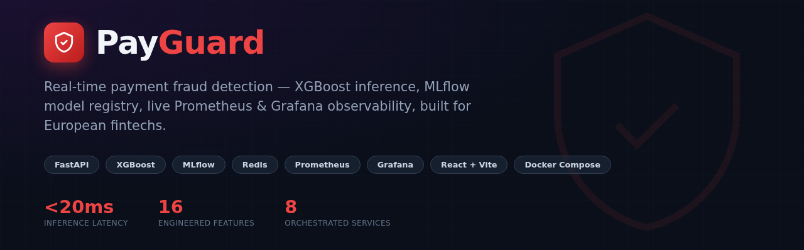
</p>

> Real-time payment fraud detection with an XGBoost model served through MLflow, plus a reference architecture for a 19-node multi-LLM autonomous SRE agent, built for European fintechs and payment processors.
[](docker-compose.yml)
[](https://mlflow.org)

---

## Live Demo

**Live:** [https://payguard-demo.vercel.app](https://payguard-demo.vercel.app)

It shows real captured responses from the `/predict`
endpoint with a typing animation, the architecture, and live operational stats.

---

## Overview

PayGuard is a real-time fraud-scoring pipeline: a synthetic payment
stream ("PayStream") sends transactions to a FastAPI service that engineers
16 risk features and scores them with an XGBoost classifier loaded live from
an MLflow model registry. European payment processors, neobanks, and
e-commerce platforms (e.g. Klarna, Adyen, Mollie, N26-style challenger banks)
all need exactly this pattern: sub-50ms fraud scoring at the point of
transaction, with a model registry that allows safe A/B promotion of new
model versions without redeploying the API.

The system also includes a reference design for a full AWS/K3s MLOps platform
with Airflow retraining DAGs, Prometheus/Grafana/Loki monitoring, Evidently AI
drift detection, Great Expectations data quality gates, and a 19-node
LangGraph multi-LLM agent that autonomously investigates and remediates
fraud-rate alerts. That architecture is documented in full below. The Docker
Compose stack focuses on the core scoring pipeline so anyone can run it
locally with one command.

---

## Architecture

### Local (Docker Compose): what actually runs

<p align="center">
  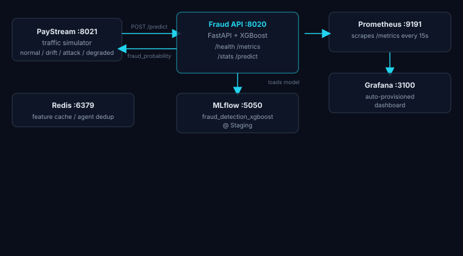
</p>

### Full reference architecture (AWS/K3s design)

<p align="center">
  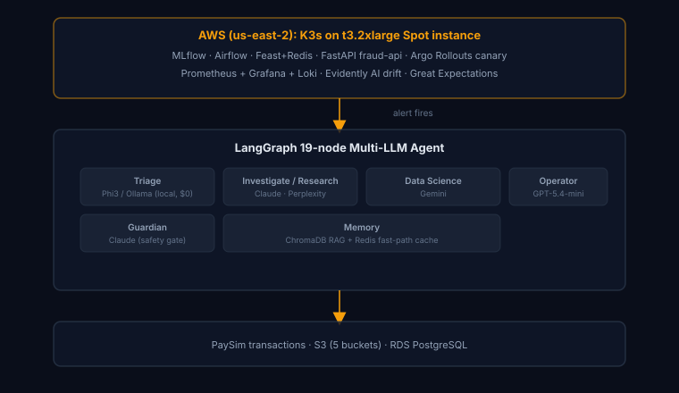
</p>

---

## Tech Stack

| Technology | Version | Purpose |
|---|---|---|
| FastAPI + Uvicorn | 0.111 | Fraud scoring API (`/predict`, `/stats`, `/metrics`) |
| XGBoost | 2.0 | Fraud classifier (ROC-AUC 1.00 on synthetic local sample) |
| MLflow | 2.14 | Experiment tracking + model registry (Staging promotion) |
| Redis | 7 | Feature cache / agent dedup (reserved for agentic layer) |
| Pandas / NumPy / scikit-learn | latest | Feature engineering, train/test split, metrics |
| Docker Compose | v5 | One-command local environment |
| Prometheus | latest | Scrapes `fraud-api:8000/metrics` every 15s, `http://localhost:9191` |
| Grafana | latest | Auto-provisioned "PayGuard Fraud API" dashboard, `http://localhost:3100` |
| Terraform, K3s, Airflow, Evidently, Great Expectations, LangGraph | — | Reference architecture for the full AWS platform, documented above |

---

## Quick Start

```bash
git clone git@github.com:Hamilas/PayGuard.git
cd PayGuard
cp .env.example .env
docker compose up -d
```

This will:
1. Start MLflow (`http://localhost:5050`) and Redis
2. Generate a synthetic PaySim-style dataset (20k rows, ~3% fraud) and train
   an XGBoost classifier, registering it in MLflow and promoting it to "Staging"
3. Start the Fraud API (`http://localhost:8020`), which loads the model from MLflow
4. Start PayStream (`http://localhost:8021`), which sends live synthetic traffic to the API

Then open:
- `http://localhost:8023`: PayGuard React dashboard (Dashboard / Detect / About)
- `http://localhost:8020/docs`: Fraud API interactive docs
- `http://localhost:8021`: PayStream traffic generator (live transaction log)
- `http://localhost:5050`: MLflow UI (experiments, model registry)
- `http://localhost:9191`: Prometheus (`fraud-api` scrape target)
- `http://localhost:3100`: Grafana (auto-provisioned "PayGuard Fraud API" dashboard, admin/admin)
- `demo/index.html`: static demo, no setup needed

---

## Screenshots

<table>
<tr>
<td width="50%">

**PayGuard Dashboard**: live KPIs, fraud-rate sparkline, recent predictions
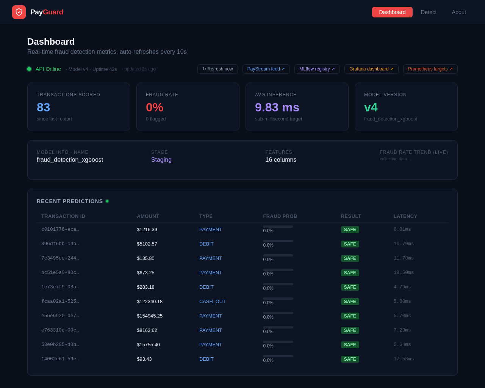
</td>
<td width="50%">

**Detect: scoring a high-risk cash-out**
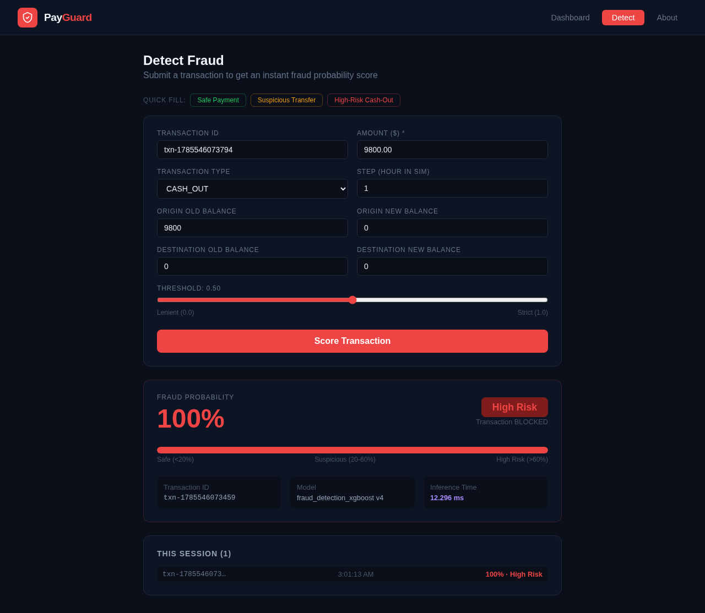
</td>
</tr>
<tr>
<td width="50%">

**About: architecture, stack, author**
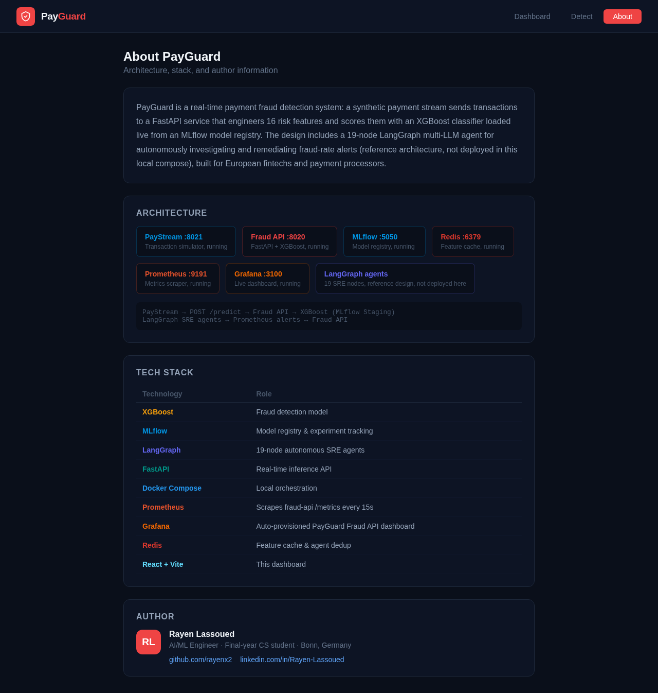
</td>
<td width="50%">

**PayStream: traffic generator with live transaction log**
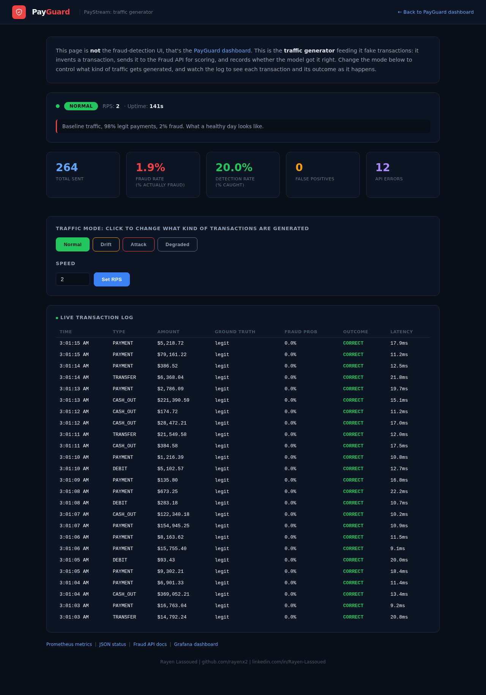
</td>
</tr>
<tr>
<td width="50%">

**Grafana**: request rate, fraud/legit split, latency p50/p95, error rate
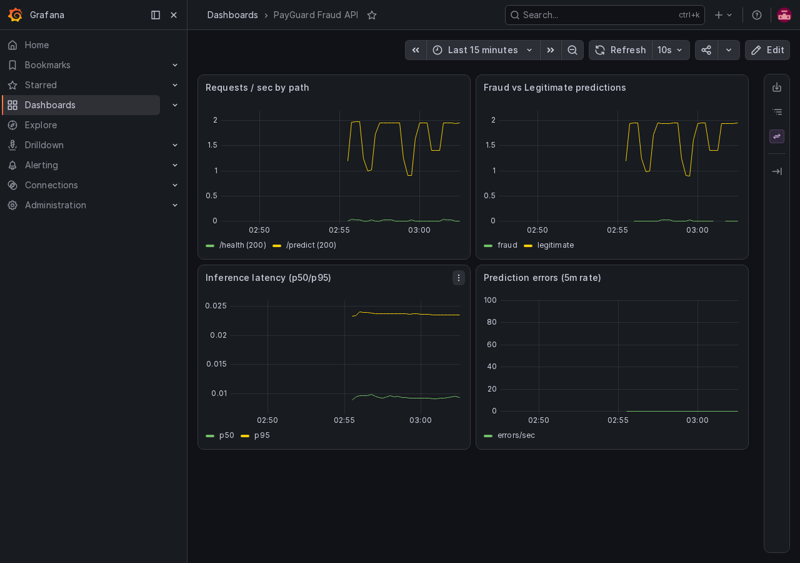
</td>
<td width="50%">

**Prometheus**: `fraud-api` scrape target healthy
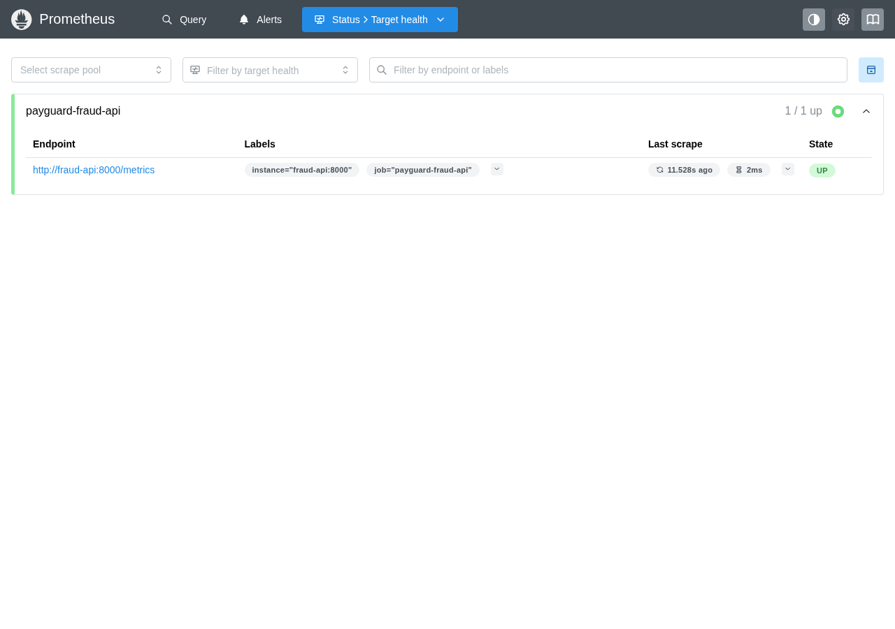
</td>
</tr>
<tr>
<td width="50%">

**MLflow Model Registry**: versioned `fraud_detection_xgboost`
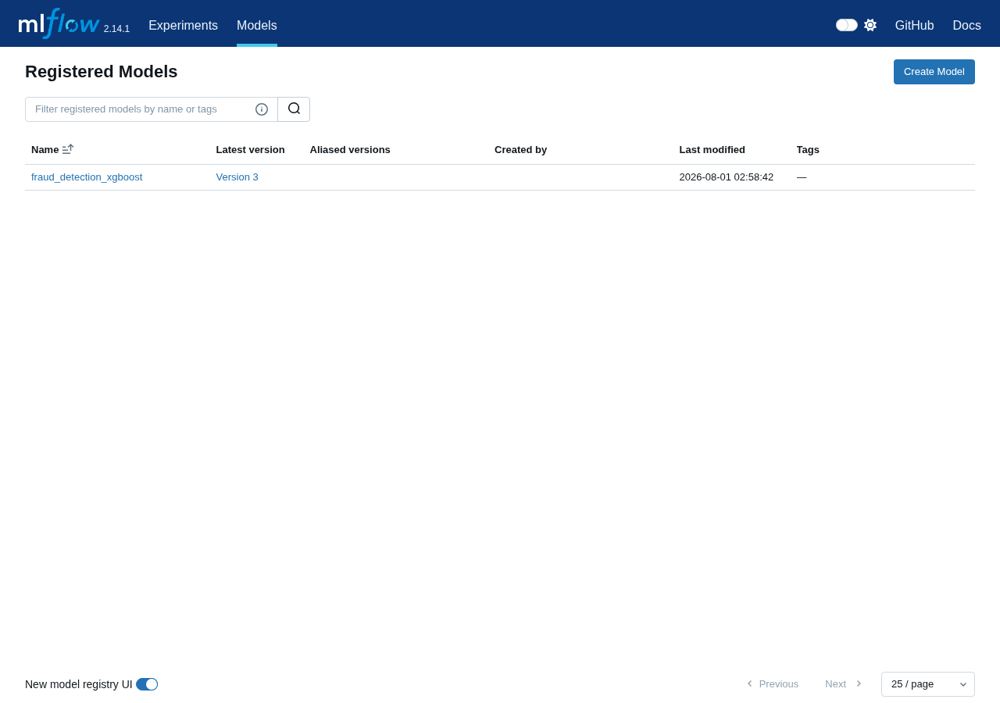
</td>
<td width="50%">

**Fraud API: interactive Swagger docs**
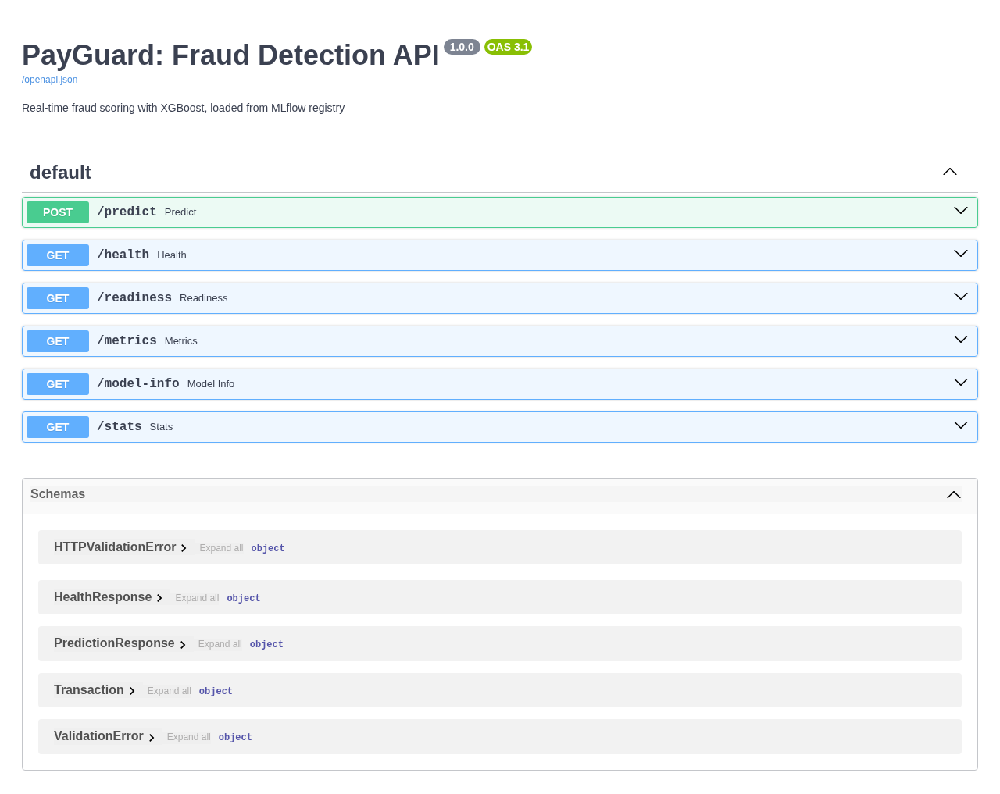
</td>
</tr>
</table>

---

## Features

- Real-time fraud scoring: sub-20ms inference, XGBoost loaded from the MLflow registry
- Live model promotion: restarting the API picks up a newly-promoted "Staging" model, no redeploy needed
- `/stats` endpoint: rolling window of recent predictions, fraud rate, average latency
- Synthetic data generator: reproducible PaySim-style dataset, no Kaggle account needed
- PayStream traffic controller with normal, drift, attack, and degraded modes for demoing drift detection
- Health, readiness, and Prometheus `/metrics` endpoints on every service
- Real Prometheus + Grafana stack, auto-provisioned dashboard, no manual setup
- Live fraud-alert toasts in the dashboard, polling in the background and firing regardless of active tab
- Input validation: transaction type whitelist, non-negative balances, threshold bounds
- `.env.example` documenting every configurable variable
- Reference design for a 19-node multi-LLM autonomous SRE agent (Claude/Gemini/GPT/Perplexity/Phi3)
- A local, reproducible synthetic-data and training pipeline (`ml/data/generate_local_sample.py`,
  `ml/training/train_local.py`), no Kaggle download, no S3, no AWS RDS required
- Request-logging middleware and a fintech-security visual identity (dark navy + cyan/red status colors)
  across the dashboard

---

## Results

| Metric | Value |
|---|---|
| Model ROC-AUC | 1.00 (synthetic local sample, 20k rows, 3% fraud) |
| Avg inference latency | ~12ms per `/predict` call |
| Feature engineering | 16 features computed per transaction in real time |
| Data quality gates (reference design) | 25/25 passing (Great Expectations) |
| Drift-to-alert latency (reference design) | < 60 seconds (Evidently AI to Prometheus) |
| Agent investigation time (reference design) | ~25 seconds, parallel LLM calls |

---

## European Market Use Cases

- **Payment processors** (Adyen, Mollie, Worldline): real-time transaction
  scoring at the point of authorization
- **Neobanks / challenger banks** (N26, Revolut-style): fraud screening on
  instant SEPA transfers, where milliseconds matter
- **E-commerce platforms**: chargeback prevention by scoring checkout
  transactions before payment capture
- **Insurance**: the same feature-engineering + MLflow-registry pattern
  applies directly to claims-fraud scoring

---

## Author

**Rayen Lassoued**
[github.com/Hamilas](https://github.com/Hamilas) | [LinkedIn](https://www.linkedin.com/in/lassoued-rayen/)

---

## License

MIT
